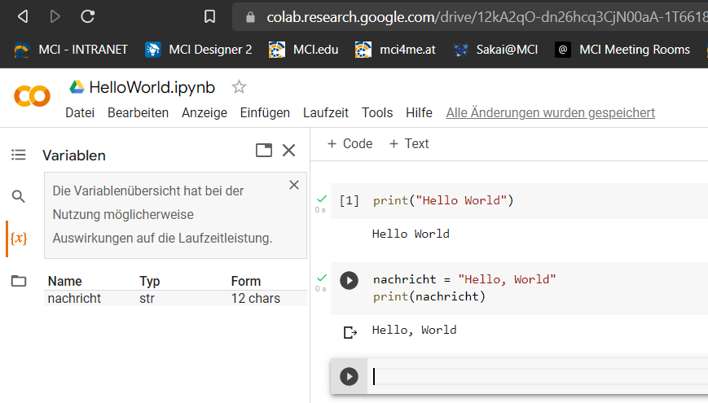
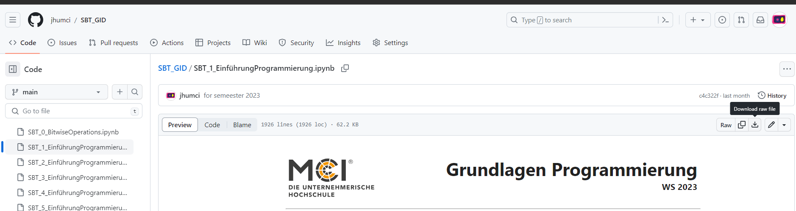
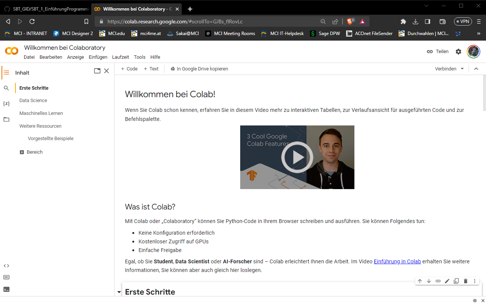
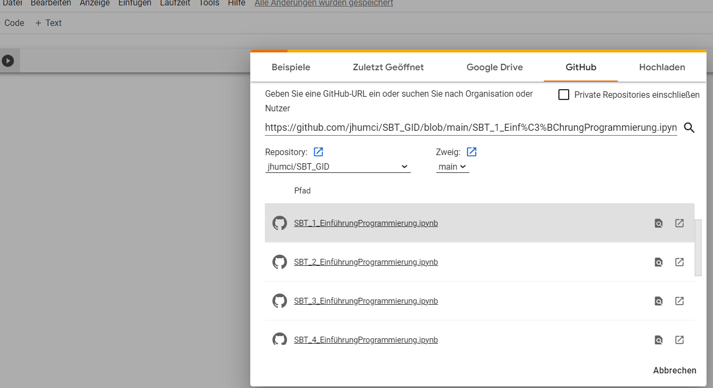

<!-- paginate: true -->

# Bio-Informatik

---

## Philosophie der Lehrveranstaltung

> nobody has to program [...] everybody in the world is now a programmer

[Jen-Hsun Huang CEO of Nvidia](https://www.youtube.com/watch?v=iUOrH2FJKfo&t=1090s)

* Tatsächlich erleichtern Werkzeuge wie [ChatGPT](https://chat.openai.com/) und [GitHub Copilot](https://github.com/features/copilot) das Programmieren heute schon enorm und werden in Zukunft noch besser
* Aktuell ist es jedoch noch so, dass interessante Ergebnisse nur durch die Kombination von Fachwissen und Programmierkenntnissen erzielt werden können
* Nie war er so einfach, wie heute programmieren zu lernen:
    * KI-Programme helfen bei der Fehlersuche
    * KI-Programme antworten auf fragen
    * KI-Programme schreiben Code (was bedeutet, dass wir uns einen großteil der Vokabel Lernens sparen können)
* Investieren Sie ein paar Stunden in die die Grundlagen des Programmierens und Sie werden bis zur KI-Apokalypse gut gerüstet sein


---

## Organisatorisches

- Der wichtigste Skill, den Sie in diesem Kurs lernen können, ist das selbstständige Lernen
- Entsprechend ist der Kurs so aufgebaut, dass Sie sich die Grundlagen des Programmierens selbstständig aneignen
- Nutzen Sie Google, Stackoverflow, ChatGPT, GitHub und andere Quellen, um sich die Grundlagen des Programmierens anzueignen
- Fragen Sie jederzeit, wenn Sie nicht weiterkommen, dies ist die schnellste und effektivste Methode, um weiterzukommen
- zum bestehen des Kurses müssen **alle Notebooks bearbeitet und mit den Lösungen abgegeben werden**
- die Musterlösungen sind in den Notebooks enthalten, versuchen Sie dennoch die Aufgaben selbst zu lösen
- Für Fehler gibt es hierbei keinen Abzug
- Sollten Notebook kopiert werden und nur umbenannt abgegeben werden, wird dies als Täuschungsversuch gewertet
- Im Anschluss wird ein Projekt in Zweier-Gruppen bearbeitet
- Am zweiten Tag steht Zeit zur Bearbeitung des **Projektes** zur Verfügung
- Das Projekt wird im **zweier-Team** bearbeitet und ergibt die **End-Note** für den Teil des Kurs
- Das folgende Skript entspricht 1:1 dem Inhalt der Notebooks

---

## Juypter Notebooks

* für die LV arbeiten mit interaktiven Notebooks, die Ihnen [hier](https://github.com/jhumci/2024_SoSe_BioInformatik/tree/main/docs) zur Verfügung stehen
* Sie erkennen die Dateien an der Endung `*.ipynb`
* der Code kann über Zellen im Browser eingegeben werden




---


### ✍️ Aufgabe

* Sofern Sie einen Google-Account Nutzen, können Sie die [Google-Colab](https://colab.research.google.com/) Umgebung nutzen, um mit den Notebooks zu arbeiten
* der Code wird auf Servern von Google kompiliert
* die Ausgabe erfolgt unter der jeweiligen Zelle
* gespeicherte Zwischenergebnisse bleiben in Ihrem Account erhalten
* Legen Sie einen neues Notebook auf [Google-Colab](https://colab.research.google.com/) an und geben Sie den folgenden Befehl ein:

```print("Hello, Word!")```

---

#### Ohne Google Account

- Unter folgenden Link können Sie die Notebooks ebenfalls ausführen. Allerdings gibt es hier keine komfortable Möglichkeit Ihre Ergebnisse zu speichern
[](https://mybinder.org/v2/gh/jhumci/2024_SoSe_BioInformatik/tree/main/docs/HEAD) 
- Alternativ können Sie die Notebooks lokal ausführen indem Sie das Paket [Anaconda](https://www.youtube.com/watch?v=h1sAzPojKMg) installieren
[](https://github.com/jhumci/2024_SoSe_BioInformatik/tree/main/docs)

---

#### Öffnen eines bestehenden Notebooks

[](https://github.com/jhumci/2024_SoSe_BioInformatik/tree/main/docs): Laden Sie auf Github die `*.ipynb`-Datei herunter und merken Sie sich den Speicherort




---



---

- Wählen Sie im Menü: `Datei/Notebook öffnen/` 
- Im öffnenden Fenster: `GitHub`, das Pop-Up zur Anmeldung bei GiHub können Sie abbrechen
- Fügen Sie den Link zur Datei ein, die Sie öffnen möchten: z.B. `https://github.com/jhumci/2024_SoSe_BioInformatik/blob/main/docs/1_variablen_und_operationen.ipynb`
- Wählen Sie die genaue Datei aus
- Speichern Sie eine Kopie über `Datei/Speichern/` 




---

#### Herunterladen eines bestehenden Notebooks

- Stellen Sie zunächst sicher, dass alles fehlerfrei läuft und die Ergebnisse wie gewünscht vorliegen
- Wählen Sie hier im Menü: `Laufzeit/Alle Ausführen`
- Nun können Sie das Notebook herunterladen
- Wählen Sie im Menü: `Datei/Herunterladen/ipynb`